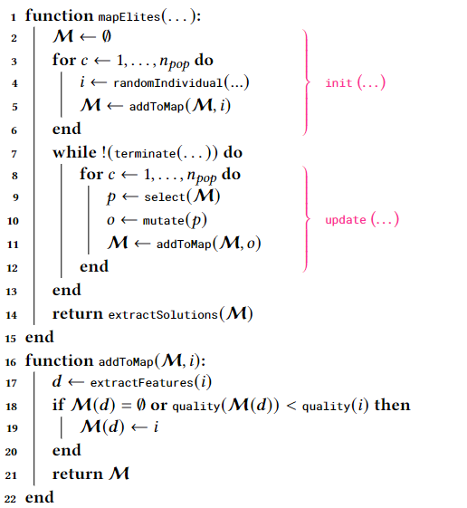

# Adding a new EA to JGEA
{: .no_toc }
To the extent of evaluating the flexibility of JGEA and its suitability for accommodating new algorithms, we examine the case study of an EC researcher who wants to implement their newly designed algorithm in the framework.
Even though a researcher could, in principle, implement everything from scratch, enclosing their algorithm in an existing framework could prove advantageous from two points of view: 
1. it saves coding time, as there are a gamut of already-defined structures available, and
2. it provides a range of ready-to-use benchmarks to test the algorithm on.

Without loss of generality, we consider the specific case of a researcher who implements Map Elites (ME) in JGEA-pretending the algorithm not to be already available in the framework.
Our choice fell on ME since it is a quality-diversity algorithm, so it slightly differs from more classical EAs, whose goal is to find only _the best_ solution, and is therefore suitable to prove that JGEA is general enough to host various flavors of EAs.

The first necessary step towards the inclusion of ME in JGEA encompasses a formal definition of the EA, either in natural language, or, preferably, in the form of a pseudo-code.
Here, to avoid ambiguities, we consider the situation in which the formalization occurs in pseudo-code, we report it in algorithm 2, but for the sake of clarity, we also provide a brief comment of the code.
The algorithm is initialized with the creation of an empty feature map <span class="mi" id="MathJax-Span-113" style="font-family: MathJax_Caligraphic;">**M**</span>, that is filled with at most _n_<sub>pop</sub> individuals.
Then, as long as the termination condition is not satisfied, _n_<sub>pop</sub> new individuals are created in batch, by mutating randomly selected parents, and added to the map <span class="mi" id="MathJax-Span-113" style="font-family: MathJax_Caligraphic;">**M**</span>.
Finally, the solutions are extracted from the map <span class="mi" id="MathJax-Span-113" style="font-family: MathJax_Caligraphic;">**M**</span> and returned.

|  | 
|:--:| 
| **Algorithm 2:** ME (batched version), with entry point in mapElites(), and the inner working of addToMap(). The bracketed annotations draw a parallel with the functions of algorithm 1. |

At this point, the researcher needs to frame their EA as a class extending the ``AbstractPopulationBasedIterativeSolver``, since it provides basic facilities that can be reused here as, e.g., the initialization and the termination criterion test.
To this end, it is convenient to highlight the chunks of ME that match the subroutines of algorithm 1 (as already done in algorithm 2), namely ``init()``, ``terminate()``, ``update()``, and ``extractSolutions()``, since each of them corresponds to a method in the ``AbstractPopulationBasedIterativeSolver`` abstract class.
This step is not only extremely useful to drive design and coding choices, but it also acts as a preliminary testing ground for the proposed EA, helping to identify possible shortcomings.
Also, some EAs might not be directly formalized into the canonical 
init-update-terminate structure, and this phase is meant for re-framing them.

Then, once the high-level correspondence between pseudo-code and code has been drawn, the researcher needs to start designing the actual ``MapElites`` class.
This phase starts from the signature of the class, where the researcher is inevitably forced to make a decision concerning the allowed values for the generics parameters, ``T``, ``P``, ``G``, ``S``, and ``Q``.
While ME does not pose specific constraints on neither ``P``, ``G``, ``S``, nor ``Q``, its state ``T`` is required to store additional data besides the usual elements of the ``POSetPopulationState``, that is the feature map <span class="mi" id="MathJax-Span-113" style="font-family: MathJax_Caligraphic;">**M**</span>.
Therefore, the research needs to define a custom state, possibly within the ``MapElites`` class, extending the ``POSetPopulationState``, where to store a data structure accounting for <span class="mi" id="MathJax-Span-113" style="font-family: MathJax_Caligraphic;">**M**</span>, that is ``MapOfElites``.
```java
public static class State<G, S, Q> extends POSetPopulationState<G, S, Q> {
  private final MapOfElites<Individual<G, S, Q>> mapOfElites;
}
```

Next, the researcher has to identify the additional elements which define an instance of the ``MapElites`` class with respect to its super class ``AbstractPopulationBasedIterativeSolver``.
In particular, ME requires a template for building the ``MapOfElites``, i.e., a list of features and a method for extracting the features from an individual, and a mutation operator to build offspring genotypes.
We do not cover the details about the data structures employed for representing the listed elements, as these are beyond the discussion.
```java
public class MapElites<G, P extends QualityBasedProblem<S, Q>, S, Q> extends AbstractPopulationBasedIterativeSolver<MapElites.State<G, S, Q>, P, G, S, Q> {
  private final Mutation<G> mutation;
  private final Function<Individual<G, S, Q>, List<Double>> featuresExtractor;
  private final List<MapOfElites.Feature> features;
}
```

Last, the researcher must give functionalities to the ``MapElites`` class.
Thanks to the _template_ design pattern, the canvas for the ``solve()`` method is already there, yet some of its subroutines are defined as abstract or need to be overriden for the specific case of ME.
Having underlined the correspondence between the functions in algorithm 1 and algorithm 2, this phase comes relatively straight-forward, and mostly consists of raw coding.
We report here only the implementation of the ``update()`` method, which mostly characterizes the behavior of ME.
```java
@Override
public void update(P problem, RandomGenerator random, ExecutorService executor, State<G, S, Q> state) throws SolverException {
  List<G> allGenotypes = state.mapOfElites.all().stream().map(Individual::genotype).toList();
  Collection<G> offspringGenotypes = IntStream.range(0, populationSize)
    .mapToObj(i -> mutation.mutate(allGenotypes.get(random.nextInt(allGenotypes.size())), random)).toList();
  Collection<Individual<G, S, Q>> offspringIndividuals = map(offspringGenotypes, List.of(), solutionMapper, problem.qualityFunction(), executor, state);
  state.mapOfElites.addAll(offspringIndividuals);
  state.setPopulation(new DAGPartiallyOrderedCollection<>(state.mapOfElites.all(), comparator(problem)));
  state.incNOfIterations();
  state.updateElapsedMillis();
}
```
The content of ``update()`` slavishly follows the prescriptions of algorithm 2, with the only addition that the individuals of the ``MapOfElites`` <span class="mi" id="MathJax-Span-113" style="font-family: MathJax_Caligraphic;">**M**</span> are doubled in the ``DAGPartiallyOrderedCollection`` of the state to allow the usage of ready-made functions monitoring the population from there.

In conclusion, we observe that adding new EAs to JGEA is quite straight-forward.
In addition, we remark that the implementation process can help researchers to frame their EA in a more understandable manner.
In fact, JGEA provides a canvas for the EA implementation, which gently forces a researcher to cast their algorithm into a well-known and clearly defined structure.
