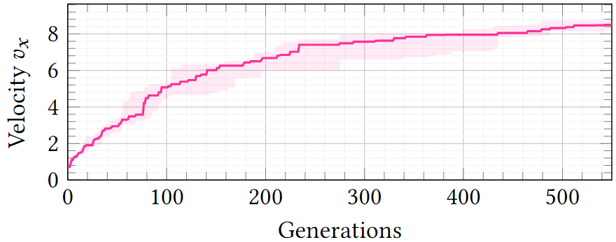

# Experimenting with JGEA
{: .no_toc }
In order to assess the suitability of JGEA for using EC as a problem-solving tool, we consider the case study of an end user who needs EC to solve an optimization problem.
As already mentioned several times, end users who rely on JGEA as a mere tool, require a solid and reliable framework, which is handy and easy to understand, and whose computation time efficiently scales with available resources.

This unwinds in being able to 
1. simply, yet precisely, define the ``Problem`` at hand,
2. neatly choose and utilize an appropriate ``Solver`` combined with the right ``Listener`` to collect the needed information during an execution, and
3. carry out the experimental evaluation within a reasonable time-frame.

Bridging the first two requirements, there is the concept of representation, as generally users do not evolve solutions to their problem directly, but rather rely on some form of encoding.
Therefore, being able to conveniently choose an appropriate solution representation becomes a crucial additional requirement.

We evaluate how JGEA meets the listed requirements in the following sections.
To avoid being overly general, we focus on the practical setting of evolutionary robotics, in which researchers make us of EC to optimize robots-either the controller, or the body, or even the sensory apparatus-to achieve a certain task.
In particular, we consider the optimization of a neural controller for a class of modular soft robots.

## Table of contents
{: .no_toc .text-delta }

1. TOC
{:toc}

---

## Problem definition
Given a problem statement written in natural language, e.g., "the goal is to optimize the controller for a robot for the task of locomotion", to formalize it within the JGEA framework a user needs to extend the ``Problem`` interface, or any of its subinterfaces.
Therefore, they first need to identify the nature of the solution, i.e., determine the solution space ``S``, and then they need to decide where to place themselves along the hierarchy of interfaces for the ``Problem``.

In this case, the solution consists of a robot, i.e., an instance of the ``Robot`` class, which, thanks to its optimized controller, outperforms the others at the locomotion task.
This task is already modeled in the employed robotic simulation framework, within the ``Locomotion`` class.
Such class is deputy to simulating the locomotion of a robot for _t<sub>f</sub>_ simulated seconds and returning its outcome, that is an object storing data about the executed simulation.
```java
Outcome outcome = locomotion.apply(robot);
```

Since the user is interested in the quality of solutions, lying in the ``Outcome``, and they are able to establish a total ordering among them, based on the velocity _v<sub>x</sub>_ extracted from the ``Outcome``, the proper interface to be implemented is ``TotalOrderQualityBasedProblem``.
To this extent, it is convenient for the user to define a record, or a class, implementing ``TotalOrderQualityBasedProblem``, to avoid creating the ``qualityFunction()`` and the ``totalOrderComparator()`` on-the-fly at every invocation.
```java
public record LocomotionProblem(
  Function<Robot, Outcome> qualityFunction, 
  Comparator<Outcome> totalOrderComparator
) implements TotalOrderQualityBasedProblem<Robot, Outcome> {}
```

Then, the user can simply instantiate the ``LocomotionProblem`` record, specifying the desired ``qualityFunction`` and ``totalOrderComparator``.
```java
Locomotion locomotion = buildLocomotionTask(/*...*/);
Problem problem = new LocomotionProblem(
  robot -> locomotion.apply(robot),
  Comparator.comparing(Outcome::getVelocity).reversed()
);
```

## Solver and Listener choice and usage
After formally defining the problem, the user needs to _solve_ it, i.e., they need to choose and utilize an appropriate ``Solver`` for the task at hand.
We remark that this phase should be as friction-less as possible, even, and especially, for researchers who are not proficient in EC and only use it as a tool.
In fact, some basic knowledge of the genotype-phenotype binomial and of the main concepts in EC should suffice.

Concerning the genotype-phenotype representation, the user must select an encoding for their solution, i.e., how to represent the robot.
This boils down to choosing which parts of the robot are handcrafted and which parts are to be optimized.
Here, we consider the case in which the body of the robot is fixed, and the goal is to find the best parameters for the Artificial Neural Network (ANN) that controls it.
Therefore, the genotype consists of the list of parameters of the ANN, a ``List<Double>``.
To obtain a solution, i.e., a robot, from this genotype, the user needs to specify how to build a robot with a controller with those parameters, i.e., they need to specify the genotype-phenotype mapping function.

```java
Function<List<Double>, Robot> mappingFunction = list -> {
  MultiLayerPerceptron mlp = new MultiLayerPerceptron(
    /*...*/,
    list //here we specify the parameters of the MLP
  );
  return new Robot(body, new CentralizedSensing(body, mlp));
};
```

Once the genotype space is well-defined (here, ``G`` is ``List<Double>``), the user needs to select an appropriate EA among the available ones.
Given the numeric genotype, a simple form of ES is the go-to EA, which is available in JGEA in the class ``SimpleEvolutionaryStrategy``.
Note that the user can employ the chosen EA without having to worry about its internals, as long as they are able to provide the required constructors parameters, such as the genotype-phenotype mapping function, the ``List<Double>`` factory, the stop condition, and some numeric parameters.

```java
public SimpleEvolutionaryStrategy(
  Function<? super List<Double>, ? extends S> solutionMapper,
  Factory<? extends List<Double>> genotypeFactory,
  int populationSize,
  Predicate<? super State<S, Q>> stopCondition,
  int nOfParents,
  int nOfElites,
  double sigma,
  boolean remap
) { /*...*/ }
```

Even though at this point the user is ready to apply the ``Solver`` to their ``Problem``, they might be interested in monitoring the execution with a ``Listener``.
For instance, a common need is to keep track of some information during the progress of evolution on a CSV file, which can be easily addressed with the ``CSVPrinter``.

At this point all needed elements are defined, and the user can solve their problem, as shown in the following excerpt of code.
```java
Solver solver = new SimpleEvolutionaryStrategy(/*...*/);
Listener listener = new CSVPrinter<>(/*...*/).build(/*...*/);
Collection<Robot> solutions = solver.solve(
    problem, random, executor, listener
);
```

Finally, we remark that oftentimes users are interested in performing multiple optimizations, to ensure the generality of their results, regardless of randomness.
To this extent, the following code can be used to perform 10 optimizations, printing all the necessary information on the same CSV file.
```java
Solver solver = new SimpleEvolutionaryStrategy(/*...*/);
ListenerFactory listenerFactory = new CSVPrinter<>(/*...*/);
for (int i = 0; i < 10; i++) {
  Listener listener = listenerFactory.build(Map.of("seed", i));
  Collection<Robot> solutions = solver.solve(
    problem, new Random(i), executor, listener
  );
}
```

From the resulting CSV file, users can conveniently analyze the experimental data altogether, extracting aggregate information about the progress of evolution and about the obtained solutions.
For instance, they can effortlessly achieve a report of the progress of solutions fitness along generations, as displayed in figure 2.

|  | 
|:--:| 
| **Figure 2:** Median and interquartile range of the fitness, i.e., the velocity v<sub>x</sub>, of the best robot across 10 optimizations during evolution. |

## Performance and scalability

End users of JGEA could suffer from constrained availability of run time or resources, so having a well-designed and optimized software becomes not only an added value but also a necessity.
Even though EAs themselves are not particularly computationally heavy, some of the operations they need to perform, e.g., fitness evaluation, might indeed be more costly from a computational point of view.
It is therefore important for the software to take advantage of available resources to distribute the costliest procedures, eventually speeding-up the entire process.

Here, we provide a brief experimental assessment of the performance of JGEA, to highlight its scalability with the amount of available resources.
We consider the evolutionary robotics setting previously described, in which the fitness evaluation of each solution-the robot-requires simulating it for a fixed and relatively large amount of time in order to actually ensure that the robot is correctly performing the given task: 40s of simulation time takes approximately 0.8 seconds of (one) core time in our settings.
We employ the aforementioned ES, with a population size of _n_<sub>pop</sub>=36.
We emulate the resources constraints by limiting the amount of available threads to _n<sub>t</sub>_, and the maximum wall time to _t<sub>c</sub>_ (we set the maximum wall time as termination criterion).
We experiment with _n<sub>t</sub>_ ∈ {1,2,4,9,18,36} and _t<sub>c</sub>_=30 min.
We perform the evaluation on a 18 core workstation (Intel Xeon Processor W-2295 3.0-4.6 GHz with 64 GB DDR4 RAM running OpenJDK 17 on Ubuntu 21.10).
Since _n<sub>t</sub>_ is always smaller than the amount of available cores, considering hyper-threading, the threads can constantly execute in parallel.
Since this is only an illustrative experiment we perform one execution for each value of _n<sub>t</sub>_, but we remark that normally a user would execute their evaluations multiple time due to randomness.

For each execution, we measure the amount of fitness evaluations performed and the velocity of the best robot in the population as a function of elapsed computation time.
We report these quantities in the plots of figure 3, with a different color for each _n<sub>t</sub>_.

|  | 
|:--:| 
| **Figure 3:** Number of fitness evaluations (above) and the fitness _v<sub>x</sub>_ of the best individual in the population (below) vs. elapsed time (in minutes). |

The results presented in the two figures support our claims concerning the scalability of JGEA.
Not surprisingly, from the top plot of figure 3 we notice a clear linear dependency between the amount of fitness evaluations performed and the amount of time, the steepness of which depends on _n<sub>t</sub>_.
This is a direct consequence of our implementation of the fitness evaluation process, whichf is performed in parallel on each of the workers of the ``ExecutorService`` passed to the ``solve()`` method.
Therefore, increasing the number of available workers, which corresponds to _n<sub>t</sub>_, we allow more evaluations to be performed simultaneously, thus accelerating the whole optimization process.

Some slightly more interesting results come out of the bottom plot of figure 3, where we display the velocity of the best individual as a function of computation time.
Even though these outcomes are a direct consequence of the observations drawn above, they are more relevant for practical cases where users have tight time constraints but more available resources and require a good solution quickly.
