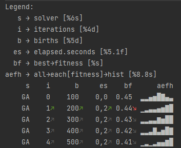

# Listener
Even though problems could in principle be solved in-the-void, it is often necessary to track the execution of the solver, extracting and saving information during the run.
To this extent, we introduce the last core component of JGEA: the ``Listener`` interface.
```java
public interface Listener<E> {
  void listen(E e);
  default void done() {}
}
```

As briefly seen from the code of the ``IterativeSolver``, a ``Listener`` has the duty to monitor, i.e., ``listen()`` to, the updates of the state during the execution of the ``solve()`` method.

We delegate the creation of ``Listener``s to a ``ListenerFactory``, which is used to build "augmented" listeners.
```java
public interface ListenerFactory<E, K> {
  Listener<E> build(K k);
}
```
This derives from the need to monitor the execution, either parallel or sequential, of multiple instances of ``Solver`` solving multiple instances of ``Problem``, being able to distinguish individual executions while saving or printing all information on the same target (e.g., the same CSV file for all the evolutionary runs).
Moreover, a ``Listener`` might need additional information (an instance of ``K``) to "augment" the results obtained by all invocations of the ``listen()`` method (e.g., the random seed of the specific run).
To this extent, we invoke the ``build()`` method for each new execution with needed information ``K k`` passed as argument, to obtain a properly augmented ``Listener`` to be assigned to the run.
We provide various realizations of the ``ListenerFactory`` interface, such as the ``TabularPrinter``, used to pretty-print useful information on the standard output, or the ``CSVPrinter``, employed to save data to a CSV file.

Concerning the information to be extracted from the state, one might be interested in the size of the population, the quality of the best individual, some function of the best individual, and so on.
To allow the users to easily define the information they want to extract, and associate a name, and possibly a display format, to it, we introduce the ``NamedFunction`` interface.
Typically, a ``List`` of ``NamedFunction``s is passed to the constructor of a ``ListenerFactory``, and each of them is invoked on a state within the ``listen()`` method to extract the needed information.
These constructs make use of modern Java features inspired by functional programming, and favor the achievement of complex behavior, i.e., extracting non-trivial information from an execution, possibly making use of composite functions, in a concise and elegant manner.

A typical example of construction of a ``TabularPrinter`` is the following, which prints on the standard output the current iteration, the total number of births, the seconds elapsed since the start of the execution, the fitness of the best individual, and the distribution of fitness in the population (as a histogram), together with the name of the employed solver (to be passed within a ``Map`` data structure to the ``build()`` method), as displayed in figure 1.
```java
ListenerFactory<POSetPopulationState<?, ?, ? extends Double>, Map<String, Object>> listenerFactory =
  new TabularPrinter<>(
    List.of(
      iterations(),
      births(),
      elapsedSeconds(),
      fitness().of(best()),
      hist(8).of(each(fitness())).of(all())
    ), 
    List.of(attribute("solver"))
  );
```
Note that this ``listenerFactory`` will be able to listen to state updates for ``POSetPopulationState``s constrained only to have at least a ``Double`` as fitness for the individuals.
As a consequence, this listener might be used to monitor and track solver runs on different problems, provided they match the kind of state they work on.
  
|  | 
|:--:| 
| **Figure 1:** Sample output of a ``TabularPrinter``. For sparing screen space, names of columns (each being a ``NamedFunction``) are automatically abbreviated.   Moreover, a graphical indication of the trend for each value is shown in the form of a colored arrow, when appropriate. Through composition of instances of ``NamedFunction``, complex processing of monitored quantities can be performed, as the histogram of fitness values. |
