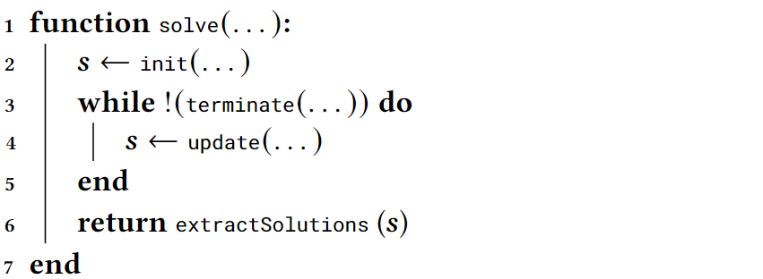

# Solver
A problem can be solved by an implementation of the ``Solver`` interface, which is responsible for providing the caller with a collection of solutions upon the invocation of its method ``solve()``.
```java
public interface Solver<P extends Problem<S>, S> {
  Collection<S> solve(
      P problem,
      RandomGenerator random,
      ExecutorService executor
  ) throws SolverException;
}
```

We highlight that, in general, a ``Solver`` might not be suitable for solving all possible problems.
Therefore, we introduce the generic parameter ``P`` to indicate the subset of problems a ``Solver`` can tackle.

We also remark that ``solve()`` takes two additional elements besides the ``P problem``: a ``RandomGenerator`` and an ``ExecutorService``, since a ``Solver`` can be non-deterministic and capable of exploiting concurrency.
The contract for the ``solve()`` method is that the passed ``RandomGenerator`` instance will be used for all the random choices, hence allowing for _repeatability_ of the experimentation (_reproducibility_, instead, might not always be guaranteed due to concurrency).
Similarly, the contract states that the ``ExecutorService`` instance will be used for distributing computation (usually, of the fitness of candidate solutions) across different workers of the executor.
In fact, population-based optimization methods are naturally suited for exploiting parallel computation (see, e.g., the large taxonomy of parallel methods already developed more than 20 years ago), and, even though we design JGEA aiming at clarity and ease of use, we also take into consideration efficiency.

We designed the ``solve()`` method of the ``Solver`` interface in order to model the stateless nature of the solver with respect to its capability, i.e., to solve problems.
Namely, since both the ``RandomGenerator`` and the ``ExecutorService`` are provided (besides the problem itself) when ``solve()`` is invoked, different problems may in principle be solved at the same time by the same instance of the solver.

Going more in details, we recall that all relevant EAs share an iterative structure, as the one sketched in algorithm 1.
We translate it into the ``solve()`` method of the ``IterativeSolver`` interface. 

|  | 
|:--:| 
| **Algorithm 1:** High-level structure of iterative EAs. |

```java
public interface IterativeSolver<T, P extends Problem<S>, S> extends Solver<P, S> {
  default Collection<S> solve(
      P problem,
      RandomGenerator random,
      ExecutorService executor,
      Listener<? super T> listener
  ) throws SolverException {
    T state = init(problem, random, executor);
    listener.listen(state);
    while (!terminate(problem, random, executor, state)) {
      update(problem, random, executor, state);
      listener.listen((T) state.immutableCopy());
    }
    listener.done();
    return extractSolutions(problem, random, executor, state);
  }
}
```

We resort to the _template pattern_ in this interface, thus we do not specify any behavior concerning the initialization, the update, or the termination of the algorithm, and _delegate_ those practicalities to the realizations of the ``IterativeSolver``.
In addition, despite the stateless nature of the ``IterativeSolver``, we need a way of keeping track of its execution, e.g., of the population being optimized, hence we introduce the concept of state, ``T state``, which is evolved across iterations starting from an initial value.
We use a generics parameter since, in principle, different solvers might require to store different structures during their execution.
Moreover, the state is used by the ``Listener`` to monitor the execution.

We remark that the structure of algorithm 1 implemented in the ``IterativeSolver`` is also common to other forms of population based optimization methods, such as particle swarm optimization or ant colony optimization.
Thus, we highlight the ease of extending JGEA to accommodate other flavors of metaheuristics starting from already existing core components.

Narrowing our view on EAs, we provide one last level of abstraction: the ``AbstractPopulationBasedIterativeSolver`` abstract class, which implements the ``IterativeSolver`` interface.
```java
public abstract class AbstractPopulationBasedIterativeSolver<T extends POSetPopulationState<G, S, Q>,
    P extends QualityBasedProblem<S, Q>, G, S, Q> implements IterativeSolver<T, P, S> {
  /*...*/
}
```
There, we model two key concepts related to EAs:
1. _individuals_, accounting for the genotype-phenotype representation, and 
2. the _population_, a partially ordered set of individuals, which we store in a custom state, a ``POSetPopulationState``.

In addition, thanks to the newly added notions, we are able to provide concrete implementations of the ``init()`` method (we initialize the state and sample the initial population), the ``terminate()`` method (we check if a given termination condition is verified), and the ``extractSolutions()`` method (we take the best individual(s) in the population).

Similarly to what we have seen for the problems, one can extend the ``AbstractPopulationBasedIterativeSolver`` to implement specific EAs.
In particular, realizations will be characterized by the ``update()`` method implementation, and might require additional customization, e.g., in the state or in the initialization (easily achievable through overriding).
Thus, we remove the burden of engineering EAs from scratch, providing users with a canvas for specific implementations.
